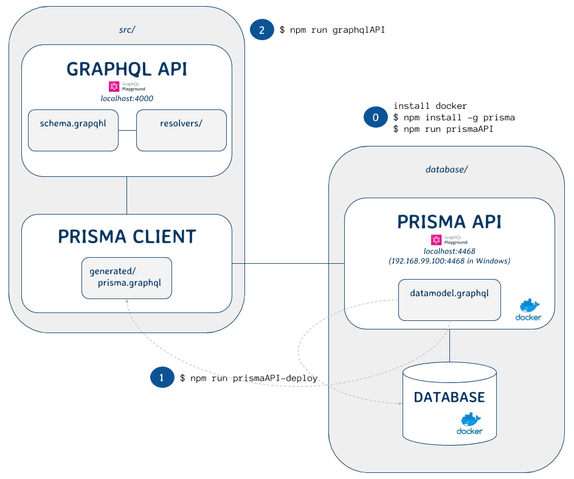
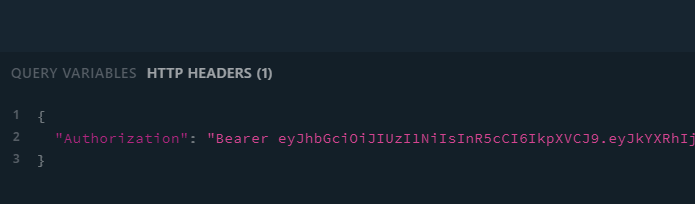
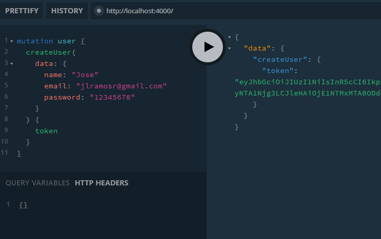
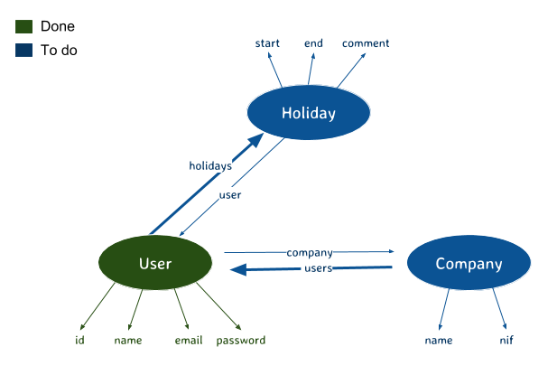

# GraphQL-Prisma Challenge



## Configuration

* Install [Docker](https://docs.docker.com/get-started/).

* Install Prisma:

```javascript
$ npm install -g prisma
```

* Clone the repo:

```javascript
$ git clone https://github.com/jlramosr/graphql-prisma-challenge.git
```

* Enter to the project and install dependencies:

```javascript
$ cd graphql-prisma-challenge
$ npm install
```

* Only if we have Windows, run the Docker MV. This step will be always necessary to run Prisma API in Windows:

```javascript
$ docker-machine start
```

* Run Prisma API with the database (they are two Docker services). This step only will be necessary the first time because both services have a *restart* configuration when Docker starts:

```javascript
$ npm run prismaAPI
```

* Deploy the Prisma API:

```javascript
$ npm run prismaAPI-deploy
```

* Run GraphQL API:

```javascript
$ npm run graphqlAPI
```

* If we have Windows, we must change the *config/dev.env* file of this way:

```javascript
PRISMA_ENDPOINT=http://192.168.99.100:4468
...
```

## Usage

### Prisma API

If we want to access to Prisma API, go to `localhost:4468` (`192.168.99.100:4468` in Windows). We will need a security token and add it to Playground *HTTP HEADERS* section:

```javascript
{
  "Authorization": "Bearer <TOKEN>"
}
```

We get this token with:

```javascript
npm run prismaAPI-token
```



### GraphQL API

Go to `localhost:4000` to access to GraphQL API. We can do public queries and mutations without any security token. For logged operations, we need to execute the `login` query and add the obtained token in the Playground section of *HTTP HEADERS* in the same way as Prisma API Playground. This token will identify myself on the API and I will be already logged in.



## Exercise - First part

### Summary

This project includes the scaffold in order to start the challenge. With the source code provided, you have to implement this new structure:



An user can belong to a Company, which only has a name and a NIF (both strings, unique and required). It's not neccesary that an user belongs to a Company. An user can create a holiday, with the start date and the end date required and an optional comment. For now, an user can note all holidays he wants. The only restriction is that days between holidays don't overlap. 

### Development

Create a new branch from master called *feature/#1* . Then, you have to follow these instructions:

#### Schemas

Firstly, modify the Prisma API schema with the new types and fields, indicating if they are required and its relations. Then, do likewise for GraphQL API schema, by the addition or modification of queries and mutations written below:

#### Queries

* **users**: modify the current one to return all the users created in the database, but only if I'm logged in. Keep the filters.

* **companies**: return all companies registered in the database. It can be filtered by name (*name__contains*). It's a public query.

* **myCompany**: it returns my own company if I belongs to one.

* **myHolidays**: it returns my holidays (empty array if I don't have yet).

#### Mutations

* **createUser**: modify the current mutation with the possibility to add a new or existent Company.

* **updateUser**: requires to be logged in. It may change my name, email or password.

* **changeMyCompany**: requires to be logged in. It changes my current company with the new one provided by id.

* **createCompany**: requires to be logged in. It creates a new Company with the name and the NIF. The user who make the action, automatically will belong to the new Company. If the company already exists, show an error.

* **updateCompany**: requires to be logged in. It updates my company (name and/or NIF).

* **createHoliday**: requires to be logged in. Create a holiday period for me, with the start date, the end date and an optional comment.

* **deleteHoliday**: requires to be logged in and the holiday belongs to me. It deletes a holiday period by id.

#### Resolvers

##### User

* **email**: only visible for users of my Company.
* **holidays**: only visible my own holidays.
* **password**: only visible my own password.

##### Company

* **nif**: only visible for users of the Company.
* **users**: only visible for users of the Company.

Deploy the PRISMA API and check your feature with the GrahpQL API Playground from *localhost:4000*

When you finish, push the branch to a public repository and file a pull request.

## Exercise - Second part

Modify the previous structure with two new features.

You can clean the database and deploy again with: 

```javascript
$ npm run prismaAPI-reset
```

You should create these branches:

* *feature/#2.1*: Now, an user can belong to more than one company. If need be, change the queries, mutations or resolvers involved. Do not add new queries or mutations. Holidays are still independent of Companies.

* *feature/#2.2*: Users has only 23 holiday days for each of their own companies. Now, holiday creations become requests to your companies instead a simple annotation for me. Make the respective changes to implement this restriction, drawing the new structure if needed. Do not add new queries or mutations.

Do the same procedure to make the pull request for each feature.

Good luck!